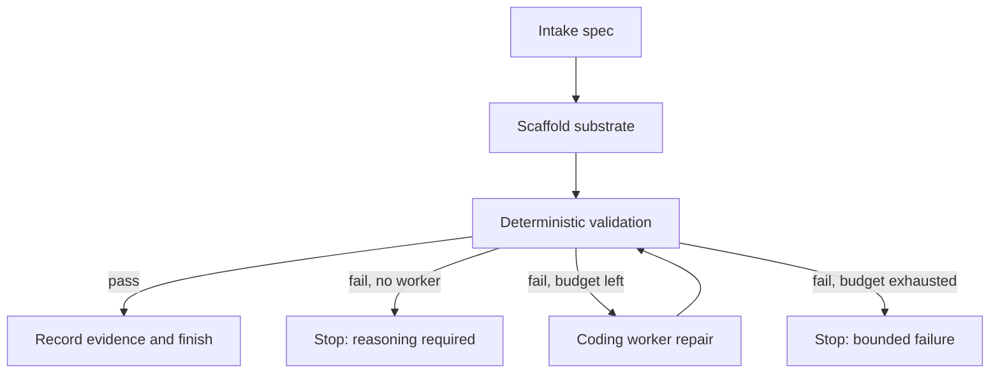

# Graph Engineering Study — full plan

Refs #1.

## Objective

Build a studyable software-engineering graph where deterministic machinery does the repeatable work and a coding model is invoked only when the graph reaches a problem that actually requires semantic reasoning.

The target is not a larger coding harness. The target is a small software factory:

1. intake a spec;
2. scaffold known-good infrastructure from an existing substrate;
3. run deterministic verification;
4. branch on evidence;
5. call a coding worker only for an unresolved failure;
6. re-run the same verification;
7. stop after a bounded number of repair attempts and preserve evidence.

The repository is intentionally a lab. Every layer should be readable in isolation.

## Source architecture

### Existing Pukujan stack

- **Agent Custom Setup (ACS)** owns execution coordination and the multi-agent hotloader. The study repo uses the real installer; it does not copy a fake `.coord` surface.
- **Observational Issue Ops (OIO)** owns observational/operational issue intake and triage. It is reference/governance, not the workflow engine.
- **App Builder Automation (ABA)** supplies the GUI/app substrate and the core design lesson: constrain generation with a complete starter, then verify the result.
- **Project Continuity Modules (PCM)** and **Content Generation Modules (CGM)** are fetched because the certified ACS hotload requires the complete stack.

### OSS study set

- **Pydantic Graph** — local typed state machine for the first executable graph.
- **Dagger** — deterministic containerized verification DAG; phase 2.
- **Nx** — project graph and generators for mature repeatable scaffolding; phase 2.
- **OpenHands Software Agent SDK** — optional OSS coding worker / comparison harness.
- **Hatchet** — durable workflow runtime once local graph semantics are understood; phase 3.

The source checkout cache lives under `.sources/` and is ignored by git. Source revisions are locked in `config/sources.lock.json`.

## Core rule

> If a deterministic tool can answer the question, do not spend inference on it.

Examples:

- create known React/Vite/shadcn plumbing → copy/generator;
- check types → TypeScript compiler;
- lint → linter;
- verify required UI hooks → deterministic completeness check;
- run tests → test runner;
- decide whether a failing trace implies a race, schema mismatch, or faulty state transition → coding worker.

## Baseline graph



The graph owns state and routing. The coding worker never decides whether the run is complete.

## Phase 0 — repository foundation

This increment does the boring work:

- initialize the repository and issue;
- record the full plan;
- lock exact source revisions;
- create a cross-platform source fetcher;
- add a CGM adapter so the real ACS installer has its required adopter surface;
- add a wrapper that invokes the current OIO-aware ACS hotloader against the release-train PCM/CGM/OIO revisions against fetched PCM/CGM/OIO checkouts;
- add a deterministic UI scaffold step that copies ABA's React/Vite/shadcn template;
- add a local Pydantic Graph workflow;
- make coding inference optional and disabled by default;
- write structured run evidence;
- add a study path and architecture notes.

This work can be inspected without an API key.

## Phase 1 — local verification

Run on a normal developer machine:

1. `python scripts/bootstrap.py`
2. `python scripts/install_hotload.py`
3. `python -m graph_study.cli diagram`
4. scaffold a sample UI workspace from ABA;
5. run the graph with a deterministic passing validator;
6. run it with a deterministic failing validator and no coding worker;
7. confirm it exits as `needs_reasoning`, rather than pretending success;
8. run the unit tests.

The expected result is a complete local graph and hotload installation with zero paid model calls.

## Phase 2 — coding worker and deterministic engineering DAG

### Coding worker

Plug in one worker through `CODING_WORKER_CMD`. Candidates:

- Codex CLI / Codex task runner;
- OpenHands SDK/CLI;
- another coding agent that can operate on a selected workspace.

The worker receives:

- the original spec;
- the exact failed validation commands;
- bounded stdout/stderr;
- current attempt number;
- an instruction to make the smallest repair and leave verification to the graph.

The worker does **not** receive authority to mark the task complete.

### Dagger

Move validation from host shell commands into a Dagger function:

```text
workspace
  -> dependency install
  -> typecheck
  -> lint
  -> unit tests
  -> browser smoke
  -> structured result
```

Dagger becomes the repeatable executable gate. Pydantic Graph still owns the state transition.

### Nx

Use Nx/generators for repeatable feature creation and project-graph-aware validation. The goal is to replace prompts such as "set up a package and all boilerplate" with high-level deterministic actions such as `create_feature(name)`.

## Phase 3 — durable outer runtime

Move the same graph semantics into Hatchet only after the local graph is stable.

Hatchet should add:

- durable execution;
- queues;
- retries for infrastructure failures;
- run history;
- concurrency limits;
- resumability.

It should not change the inference boundary. A durable workflow with too many LLM decisions is still a bad workflow.

## GUI path

ABA is the GUI substrate, not a source file dump.

The study lab scaffolds the existing `templates/react-vite-shadcn` tree into a disposable workspace. A sample control-room spec in `examples/control-room.md` defines the desired study UI:

- graph nodes and current state;
- run timeline;
- deterministic gate results;
- repair attempt count;
- coding-worker enable/disable state;
- evidence drawer;
- cost budget.

Later, ABA's own generation loop can fill this shell. The graph engine remains independent of the GUI.

## Cost model

Default baseline: **$0 inference**.

A paid/hosted coding worker is opt-in. Initial target budget for the repair experiment:

- maximum 2 coding-worker calls per run;
- no model call on a passing deterministic path;
- stop instead of looping when budget is exhausted;
- preserve the failure evidence for a stronger/manual worker.

This is intentionally compatible with a roughly $0–$1 experiment, but actual provider pricing is external and must be measured rather than assumed.

## Safety and rollback

- Never edit anything inside `.sources/`.
- Never put credentials in the repo.
- Never let the coding worker alter the graph's success criteria.
- Validation must be repeatable and called after every repair.
- Repair loops are bounded.
- Workspaces are disposable under `.workspaces/`.
- The first baseline uses copy-on-scaffold rather than modifying ABA itself.
- ACS/OIO installers are called from pinned checkouts; their fail-closed behavior is preserved.

## What to measure

| Experiment | Deterministic work | Inference work | Evidence |
| --- | --- | --- | --- |
| Clean UI scaffold | copy substrate, file checks | none | source revision + workspace manifest |
| Broken type import | typecheck locates failure | coding worker proposes repair | before/after typecheck |
| Broken behavior | browser/test reproduction | coding worker diagnoses root cause | test trace + rerun |
| Repeated infrastructure failure | retry/stop policy | none | attempt history |
| Unknown bug after 2 repairs | bounded stop | two worker calls max | final failure bundle |

## Definition of success

The project is useful when a reader can answer all of these by inspecting or running it:

1. Which nodes are deterministic?
2. Where is inference allowed?
3. What exact evidence causes each edge?
4. Who decides success?
5. How is a failed coding attempt bounded?
6. How is the GUI substrate created without asking a model to reinvent project setup?
7. How would Dagger/Nx/Hatchet replace pieces without changing the graph's core contract?

## Deliberate non-goals

- no multi-agent debate swarm;
- no LLM-as-test-runner;
- no LLM reviewer when a compiler/test can decide;
- no vendored copies of upstream OSS;
- no automatic deployment;
- no claim that this GitHub-only increment has executed local Docker/Node/browser workloads.

## Next verification step

Use Codex or another coding worker **after** the deterministic scaffold is checked out locally: run bootstrap, install the hotload, run tests, exercise one induced failure, and fix any integration mistakes found by the real environment.
