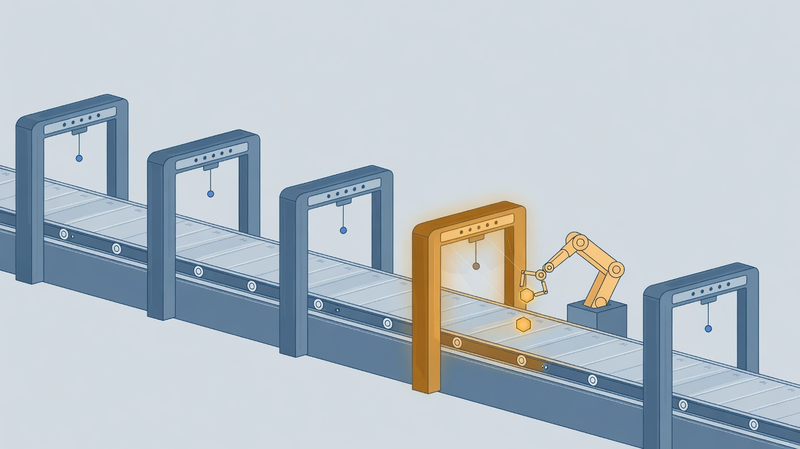

# Graph Engineering Study



**Deterministic factory, optional reasoning.** The graph owns the success edge.

A study lab for one architecture question: how much of a software factory should be ordinary deterministic code, and how small can the coding-model edge be? The repository pins existing open-source and project references, reuses a mature frontend substrate, makes every deterministic graph edge explicit, and calls a coding worker only on a failure the machinery cannot resolve itself.

It deliberately does not vendor the upstream systems. It records exact revisions and fetches them into a local, git-ignored source cache.

## Why this exists

A capable coding model is often handed work that ordinary software already does more reliably. Setup, routing, retries, and pass/fail judgement get spent as inference even though a shell command or a typed state machine can decide them exactly.

The opposite failure is just as common. A design-first app builder scaffolds a project in seconds and then stalls on the first hard debugging problem, because nothing in it can tell the difference between "the code compiles" and "the app works".

This lab puts both halves in one place and draws the line between them on purpose. The substrate and the control flow are deterministic. The model is a bounded repair edge that runs only after deterministic validation has already failed.

## What is here

```text
spec
  |
  v
scaffold from known substrate     deterministic
  |
  v
validate                           deterministic
  | pass
  +-----------------------------> finish + evidence
  |
  | fail
  v
coding worker                      optional inference
  |
  v
validate again                     deterministic
```

The initial GUI substrate comes from `Pukujan/app-builder-automation`. The real multi-agent install path comes from `Pukujan/agent-custom-setup`, which pins its companion checkouts at the release-train revisions recorded in `config/sources.lock.json`.

## Status and evidence

| Slice | What is delivered | Status | Evidence |
| --- | --- | --- | --- |
| Graph control flow | Success is a deterministic exit-status decision, not a model judgement | Shipped | [`src/graph_study/flow.py` at `ac985d3`](https://github.com/Pukujan/graph-engineering-study/blob/ac985d31e16272186115903ecddf9072356595d6/src/graph_study/flow.py) — the `Validate` node branches on validator exit status |
| Validator execution | Bare commands such as `pnpm` resolve through PATH and PATHEXT on every platform | Shipped | [`src/graph_study/actions.py` at `ac985d3`](https://github.com/Pukujan/graph-engineering-study/blob/ac985d31e16272186115903ecddf9072356595d6/src/graph_study/actions.py) — `_resolve_executable` |
| Scaffolding | A known React/Vite/shadcn substrate is copied and its source revision recorded | Shipped | `scaffold_from_app_builder` in `src/graph_study/actions.py`, covered by `tests/test_actions.py` |
| Local end-to-end run | Docker, Node, browser, and coding-worker paths on your machine | Not verified here | Pull-request CI checks Python, tests, and graph rendering only |
| Dagger / Nx / Hatchet | Later study phases | Planned | `PLAN.md` |

Both code claims are pinned to commit `ac985d3`, so they can be re-read later even as the branch moves. Source reads prove what the code says, not that it ran on your machine; the local-run row above records that boundary honestly.

## Read first

- [PLAN.md](PLAN.md) — full implementation and study plan.
- [docs/architecture.md](docs/architecture.md) — node boundaries and why inference is small.
- [docs/study-path.md](docs/study-path.md) — what to reverse-study in every source repo.
- [Issue #1](https://github.com/Pukujan/graph-engineering-study/issues/1) — implementation record.
- [Issue #2](https://github.com/Pukujan/graph-engineering-study/issues/2) — long-running IAM A/B benchmark design.

## Bootstrap

Requires Git and Python 3.10+.

```bash
python scripts/bootstrap.py
```

That fetches the locked sources into the local source cache, creates `.venv/`, installs the pinned Pydantic Graph checkout, installs this package, and installs the OIO validator dependency.

It does **not** call a coding model.

To also run the real ACS hotloader against this repo:

```bash
.venv/bin/python scripts/install_hotload.py
```

On Windows use `.venv\Scripts\python.exe`.

## Inspect the graph

```bash
graph-study diagram
```

The executable state machine lives in `src/graph_study/flow.py`.

## Scaffold the GUI substrate

```bash
python scripts/scaffold_ui.py \
  --out .workspaces/control-room \
  --spec examples/control-room.md
```

Add `--install` to run the substrate's pinned `pnpm install --frozen-lockfile`.

This copies the already-built React/Vite/shadcn substrate. It does not ask a model to invent routing, TypeScript configuration, Tailwind setup, or UI primitives.

## Run without inference

After dependencies exist in the workspace:

```bash
graph-study run \
  --spec examples/control-room.md \
  --workspace .workspaces/control-room \
  --validate "pnpm run typecheck"
```

If the validator passes, the graph finishes without a model call.

If it fails and no coding worker is configured, the graph ends in `needs_reasoning`. That is deliberate: it exposes the point where deterministic machinery ran out.

## Add a coding worker

Set a command template through `CODING_WORKER_CMD` or `--coding-worker`.

The template may use:

- `{workspace}`
- `{task_file}`
- `{attempt}`

Example shape:

```bash
export CODING_WORKER_CMD='your-coding-agent --workspace {workspace} --task {task_file}'
```

The graph supplies the exact failed validation evidence. The worker may patch the workspace, but **cannot mark the run successful**. The same deterministic validator runs again. Repair attempts default to two.

This is where Codex/OpenHands/etc. plug in later.

## Why this is not another generic coding harness

The baseline intentionally removes work from the coding model:

- project setup comes from a known substrate;
- workflow state is explicit;
- retry budget is code;
- validators are code;
- evidence capture is code;
- success is an exit-status decision;
- inference is only a repair edge.

Phase 2 adds Dagger and Nx around those same semantics. Phase 3 studies Hatchet as the durable runtime. See [PLAN.md](PLAN.md).

## Boundaries and the local evidence boundary

This repository was assembled through GitHub. The pull-request CI can validate Python syntax, the current Pydantic Graph API, tests, and graph rendering.

It does **not** prove the full local hotload, Node/pnpm app build, Docker, browser, Dagger, or coding-worker path works on your machine. That is the next operator verification step, and failures from it should be fixed as evidence rather than hidden.

## Hotload compatibility note

The study lock deliberately uses the current ACS installer head because the train-certified ACS revision predates the four-component `--oio-root` install path. The companion checkouts still follow the revisions required by that installer's `stack-mesh.json`.

On Windows the hotload installs the coordination surface and then stops at the OIO step. OIO's installer needs descriptor-relative, no-follow filesystem calls (`os.supports_dir_fd` plus `O_NOFOLLOW` and `O_DIRECTORY`) that Windows Python does not provide, so ACS reports a partial install instead of faking success. The coordination surface is still written and validated; the issue-log surface is what remains. This is tracked as [observational-issue-ops issue #32](https://github.com/Pukujan/observational-issue-ops/issues/32), and macOS, Linux, or WSL installs OIO cleanly.
